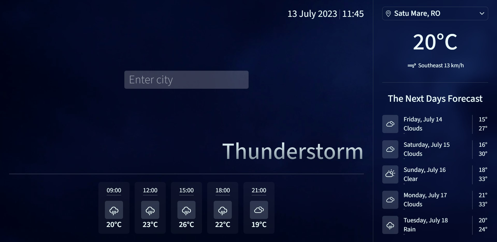
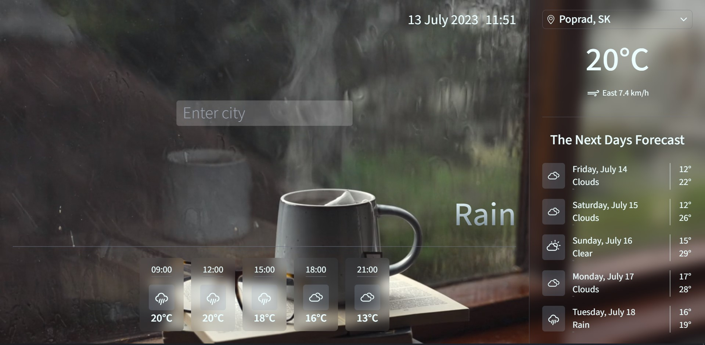

# WeatherMaster

It's an app that allows you to monitor the current weather in a specific city, also it shows you visuals of the current weather.

## Tech Stack

TypeScript, React, Axios, Tailwind + React-Icons for SVGs


## Screenshots






## Run Locally

Clone the project

```bash
  git clone git@git.dzencode.com:crm.29147/weathermaster-app.git
```

Go to the project directory

```bash
  cd weathermaster
```

Install dependencies

```bash
  npm install
```

Start the server

```bash
  npm run dev
```


## Environment Variables

To run this project, you will need to add the following environment variables to your .env file

`VITE_WEATHER_API_KEY` - API key of your account on [OpenWeather](https://openweathermap.org/)
